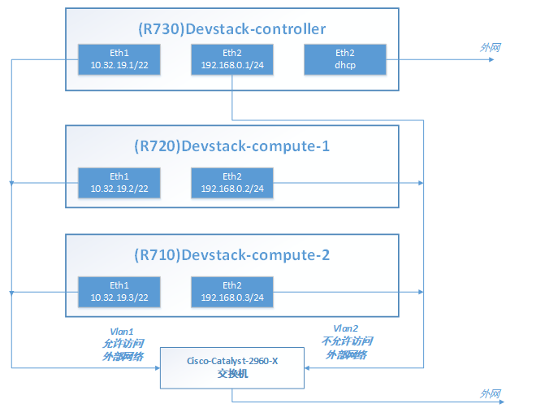
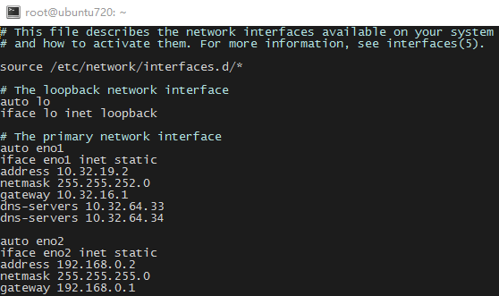
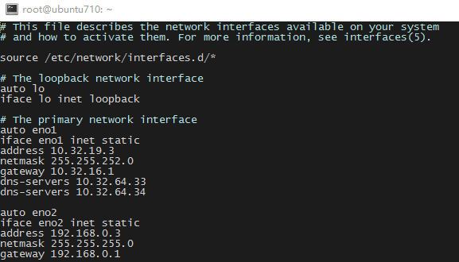

# 1.部署环境

本次openstack部署环境为三台服务器，系统统一为ubuntu16.04 server。三台服务器分别为R730，R720，R710，其中R730作为控制节点+网络节点+计算节点，R710与R720作为计算节点。 <!--more-->

部署环境如下图所示：  其中各机器eth1网卡为管理及API网络（同时也是部署与下载网络），eth2网卡为虚拟机内部租户网络，控制节点R730服务器的eth2网卡为用来上网的外部网络。

其中各节点安装服务列表如下： (R730)Devstack-controller：Keystone,Glance,Cinder,Neutron,Nova..... (R720)Devstack-compute-1：KVM Hypervisor,Nova,Neutron agent.... (R710)Devstack-compute-2：KVM Hypervisor,Nova,Neutron agent....

# 2.控制节点网络拓扑


外网网卡eth2绑定OVS外部网络网桥Br-ex，再通过虚拟路由器连接内部OVS网桥Br-int与Br-ex，实现内部虚拟机与外部的通信。 但由于虚拟路由默认自带DHCP功能，会污染外部网络，所以目前的做法是将虚拟路由的DHCP功能关闭，为内部一台跳板机手动配置IP，然后所有内部虚拟机通过此跳板机访问。

# 3.部署过程细节

## 1.为各台服务器配置网卡参数

/etc/network/interfaces

R730：  R720：  R710： 

重启机器

 

## 2.配置devstack相关环境

### 1.配置中国的镜像源

Vi /etc/apt/sources.list

```
deb http://mirrors.aliyun.com/ubuntu/ xenial main restricted universe multiverse
deb http://mirrors.aliyun.com/ubuntu/ xenial-security main restricted universe multiverse
deb http://mirrors.aliyun.com/ubuntu/ xenial-updates main restricted universe multiverse
deb http://mirrors.aliyun.com/ubuntu/ xenial-proposed main restricted universe multiverse
deb http://mirrors.aliyun.com/ubuntu/ xenial-backports main restricted universe multiverse

```

Apt-get update Apt-get upgrade

### 2.配置PIP源

Mkdir /root/.pip

Vi /root/.pip/pip.conf

```
[global]
timeout = 60
index-url = http://pypi.douban.com/simple
trusted-host = pypi.douban.com
```

### 3.下载devstack代码

本次部署使用的openstack是newton版本

git clone [https://git.openstack.org/openstack-dev/devstack](https://git.openstack.org/openstack-dev/devstack) -b stable/newton (网络慢的话可以考虑本机下载后SCP到服务器上)

### 4.配置devstack部署安装相关环境

安装python-pip Apt-get install python-pip

创建stack用户 Devstack/tools/create-stack-user.sh 添加权限 Vi /etc/sudoers

```
# User privilege specification
root    ALL=(ALL:ALL) ALL
stack   ALL=(ALL:ALL) ALL

```

Chmod 777 /edv/pts/0

Mv devstack /opt/stack/ Chown -R stack:stack /opt/stack/devstack

切换到stack用户 Su - stack Cd devstack

### 5.编写配置文件

Vi local.conf 配置文件可选参数太多，不再列出，下附本次部署的配置文件

R730(控制节点)部署文件local.conf:

```
[[local|localrc]]
 
MULTI_HOST=true
 
# management & api network
HOST_IP=10.32.19.1
LOGFILE=/opt/stack/logs/stack.sh.log
 
# Credentials
ADMIN_PASSWORD=admin
MYSQL_PASSWORD=secret
RABBIT_PASSWORD=secret
SERVICE_PASSWORD=secret
SERVICE_TOKEN=abcdefghijklmnopqrstuvwxyz
 
# enable neutron-ml2-vlan
disable_service n-net
enable_service q-svc,q-agt,q-dhcp,q-l3,q-meta,neutron,q-lbaas,q-fwaas
Q_AGENT=openvswitch
ENABLE_TENANT_VLANS=True
TENANT_VLAN_RANGE=3001:4000
PHYSICAL_NETWORK=eno2
 
LOG_COLOR=True
LOGDIR=$DEST/logs
SCREEN_LOGDIR=$LOGDIR/screen
 
#network
FIXED_RANGE=192.168.0.0/24
NETWORK_GATEWAY=192.168.0.1
FLOATING_RANGE=10.32.19.0/22
PUBLIC_NETWORK_GATEWAY=10.32.16.1
Q_FLOATING_ALLOCATION_POOL=start=10.32.19.3,end=10.32.19.10
 
# use TryStack git mirror
GIT_BASE=http://git.trystack.cn
NOVNC_REPO=http://git.trystack.cn/kanaka/noVNC.git
SPICE_REPO=http://git.trystack.cn/git/spice/spice-html5.git
 
 

```

R720(计算节点)部署文件local.conf:

```
[[local|localrc]]
 
MULTI_HOST=true
 
# management & api network
HOST_IP=10.32.19.2
 
# Credentials
ADMIN_PASSWORD=admin
MYSQL_PASSWORD=secret
RABBIT_PASSWORD=secret
SERVICE_PASSWORD=secret
SERVICE_TOKEN=abcdefghijklmnopqrstuvwxyz
 
# Service information
SERVICE_HOST=10.32.19.1
MYSQL_HOST=$SERVICE_HOST
RABBIT_HOST=$SERVICE_HOST
GLANCE_HOSTPORT=$SERVICE_HOST:9292
Q_HOST=$SERVICE_HOST
KEYSTONE_AUTH_HOST=$SERVICE_HOST
KEYSTONE_SERVICE_HOST=$SERVICE_HOST
 
ENABLED_SERVICES=n-cpu,q-agt,neutron,n-api-meta,cinder,c-vol,placement-client
Q_AGENT=openvswitch
ENABLE_TENANT_VLANS=True
TENANT_VLAN_RANGE=3001:4000
PHYSICAL_NETWORK=default
 
# vnc config
NOVA_VNC_ENABLED=True
NOVNCPROXY_URL="http://$SERVICE_HOST:6080/vnc_auto.html"
VNCSERVER_LISTEN=$HOST_IP
VNCSERVER_PROXYCLIENT_ADDRESS=$VNCSERVER_LISTEN
 
LOG_COLOR=True
LOGDIR=$DEST/logs
SCREEN_LOGDIR=$LOGDIR/screen
 
# use TryStack git mirror
GIT_BASE=http://git.trystack.cn
NOVNC_REPO=http://git.trystack.cn/kanaka/noVNC.git
SPICE_REPO=http://git.trystack.cn/git/spice/spice-html5.git
 

```

R710(计算节点)部署文件local.conf:

```
[[local|localrc]]
 
MULTI_HOST=true
 
# management & api network
HOST_IP=10.32.19.3
 
# Credentials
ADMIN_PASSWORD=admin
MYSQL_PASSWORD=secret
RABBIT_PASSWORD=secret
SERVICE_PASSWORD=secret
SERVICE_TOKEN=abcdefghijklmnopqrstuvwxyz
 
# Service information
SERVICE_HOST=10.32.19.1
MYSQL_HOST=$SERVICE_HOST
RABBIT_HOST=$SERVICE_HOST
GLANCE_HOSTPORT=$SERVICE_HOST:9292
Q_HOST=$SERVICE_HOST
KEYSTONE_AUTH_HOST=$SERVICE_HOST
KEYSTONE_SERVICE_HOST=$SERVICE_HOST
 
ENABLED_SERVICES=n-cpu,q-agt,neutron,n-api-meta,cinder,c-vol,placement-client
Q_AGENT=openvswitch
ENABLE_TENANT_VLANS=True
TENANT_VLAN_RANGE=3001:4000
PHYSICAL_NETWORK=default
 
# vnc config
NOVA_VNC_ENABLED=True
NOVNCPROXY_URL="http://$SERVICE_HOST:6080/vnc_auto.html"
VNCSERVER_LISTEN=$HOST_IP
VNCSERVER_PROXYCLIENT_ADDRESS=$VNCSERVER_LISTEN
 
LOG_COLOR=True
LOGDIR=$DEST/logs
SCREEN_LOGDIR=$LOGDIR/screen
 
# use TryStack git mirror
GIT_BASE=http://git.trystack.cn
NOVNC_REPO=http://git.trystack.cn/kanaka/noVNC.git
SPICE_REPO=http://git.trystack.cn/git/spice/spice-html5.git
 
 

```

## 3.部署过程

首先在R730控制节点运行 ./stack.sh 等待部署完成，差不多2钟头内就会完成

然后把外网网卡eno2绑定到外部网络网桥br-ex上，把eno2的ip交给br-ex网桥。接着把/etc/neutron/l3\_agent.ini中external\_network\_bridge选项改为br-ex。 同时，修改/etc/neutron/plugins/ml2/ml2\_conf.ini文件，把br-ex对应的项目选择正确，同时记录flat\_networks的名称，与下面的外网网桥对应，此名称即为horizon中FLAT网络类型的物理网络名称，一定不可填错。最后通过screen -x stack进入neutron服务，重启之，即可。

然后在R710和R720计算节点运行 ./stack.sh 既可（计算节点部署时间在30分钟以内，可随时按上述操作步骤新增计算节点）

# 4.其他杂项

## 1.部署过程中出错的解决方案

首先查看错误类型，常见的错误是网络问题导致下载失败 然后运行 ./unstack.sh 解除安装

再运行 ./clean.sh 清理环境

然后重试安装，如果还是出BUG的话，删除/opt/stack/目录，删除stack用户，重新git clone一个devstack包，创建stack用户进行安装(记得查看python-pip有无安装，没有安装一定要先安装好)

## 2.更改devstack部署配置local.conf

直接./unstack.sh然后./stack.sh重新部署既可，速度很快，10分钟内就会重新部署完成

## 3.重启服务器导致所有服务全部宕机

直接./unstack.sh然后./stack.sh重新部署既可，速度很快，10分钟内就会重新部署完成

## 4.调试openstack各模块参数后重启服务

使用screen重启服务，切换到stack用户 运行 screen - x stack（或查找screen编号） 通过ctrl+a+p  ctrl+a+n 切换openstack服务 通过ctrl+c 中断服务，然后在对应的窗口按 ↑ 回车 重启服务

## 5.使用不了openstack命令API

首先source openrc admin admin

## 6.希望指定由具体哪台服务器创建虚拟机

创建Zone和Aggreate（以R730为例） Source openrc admin admin Nova aggregate-create 3 3 把对应的服务器分配进zone里 Nova aggregate-add-host 3 R730 查看 zone信息 Nova service-list 如上方法吧R710和R720分进不同zone

再进入horizon创建虚拟机界面，就会有域选择  选择1就从710创建，选择2从720创建，选择3从730创建。

## 7.解决devstack部署openstack默认配额问题

可直接修改/etc/nova/nova.conf配置文件中的默认选择（如 quota\_instances=10），然后重启nova服务 也可以直接修改 source openrc admin admin 查看租户配额 Nova quota-defaults --tenant 租户名 改变租户配额(举例改变实例数量) Nova quota-update --instance 999 租户名

---

## 历史评论 (2 条)

*以下评论来自原 WordPress 站点，仅作存档展示。*

> **whut_wu** (2017-08-15 17:19)
>
> 博主你好，感觉你的博客访问速度很快，延时也下，请问是自己搭建的服务器还是买的虚拟主机啊？能推荐一下买的哪家吗，谢谢

  > ↳ **calmkart** (2017-08-16 09:31)
  >
  > 我在
  > https://www.vultr.com/
  > 买的服务器
  > https://www.vultrvps.com/test-server
  > 这里可以先测试下速度，我个人用的洛杉矶的服务器
  > 支付可以使用paypal，挺方便的
