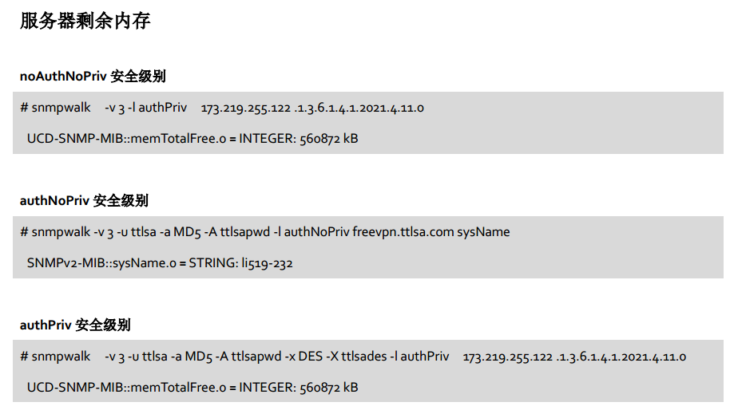

因为windows本身是不支持snmp v3的，所以需要第三方工具的帮助 这里我们选择常用的net-snmp <!--more-->

#### **步骤：**

1.关闭本系统中的SNMP服务

2.安装vc x64库

3.安装openssl x64版本(最新版本)

4.解压openssl 0.9.8zf x64版，将ssleay32.dll和libeay32.dll复制进c:/windows/system32和c:/windows/syswow64 里，替换原文件

5.安装net-snmp-5.5.0-2.x64版本的net-snmp，记得勾选with windows extension dll support和encryption support(openssl)选项(WINDOWS DLL可以开启一些不能使用的功能，encrytion support才可以开启登录且验证的SNMP V3功能)

6.安装activeperl，默认安装既可

7.运行c:/usr/registeragent.bat 把SNMP V3服务进行注册

8.编写 c:\\usr\\etc\\snmp\\snmpd.conf 配置文件，这里我用的配置如下（细节不赘述）

```
agentAddress  udp:0.0.0.0:161
createUser authPrivUser  SHA "passwordauthprivuser"  DES
#  Full read-only access for SNMPv3
#  Full write access for encrypted requests
#     Remember to activate the 'createUser' lines above
rouser   authPrivUser   priv
sysLocation    Sitting on the Dock of the Bay
sysContact     Me <me@example.org>
# Application + End-to-End layers
sysServices    72
# At least one  'mountd' process
proc  mountd
# No more than 4 'ntalkd' processes - 0 is OK
proc  ntalkd    4
# At least one 'sendmail' process, but no more than 10
proc  sendmail 10 1
# 10MBs required on root disk, 5% free on /var, 10% free on all other disks
#disk       /     10000
#disk       /var  5%
#includeAllDisks  10%
# Unacceptable 1-, 5-, and 15-minute load averages
load   12 10 5
#   send SNMPv2c traps
#   send SNMPv2c INFORMs
# Remember to activate the 'createUser' lines above
iquerySecName   internalUser       
rouser          internalUser
# generate traps on UCD error conditions
defaultMonitors          yes
# generate traps on linkUp/Down
linkUpDownNotifications  yes
#  Run as an AgentX master agent
master          agentx
#  Listen for network connections (from localhost)
#  rather than the default named socket /var/agentx/master

```

#### **测试：**

snmp v3 安全级别有三种，分别为 noAuthNoPriv（不认证也不加密）、authNoPriv（认证但是不加密）、 authPriv（既认证又加密）



常见的 SNMP OID列表 监控需要用到的OID如下连接:

[http://www.ttlsa.com/monitor/snmp-oid/](http://www.ttlsa.com/monitor/snmp-oid/)

 

本次整个配置过程所有程序安装包在此下载:

[http://www.calmkart.com/snmp\_v3\_allinone.rar](http://www.calmkart.com/snmp_v3_allinone.rar)

---

## 历史评论 (3 条)

*以下评论来自原 WordPress 站点，仅作存档展示。*

> **华为谢的总** (2017-08-14 16:53)
>
> 彭总666

> **门面の霸** (2017-08-15 11:54)
>
> 彭总吊炸天

> **Ares** (2020-03-16 09:43)
>
> 谢谢啊只不过找到的有点迟了，参考了这个https://syesilbulut.blogspot.com/2015/04/net-snmp-step-by-step-installation.html 搞完了发现你这个了 完了重新安装了一遍
