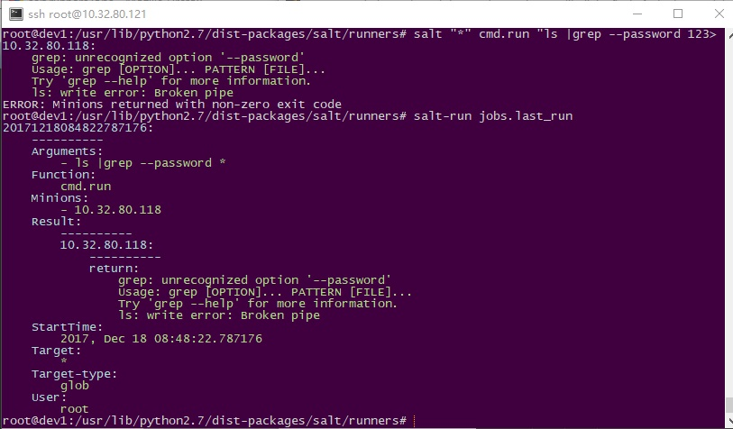

在salt master中为各个minion运行各种命令，当输入命令中显式带有账号密码时，可以在master端通过 salt.runners.jobs.last_run() salt.runners.jobs.list_job() salt.runners.jobs.list_jobs() salt.runners.jobs.list_jobs_filter() 等种种方法查看到账号密码，这样就会有安全风险。 所以，可以通过修改salt源码的方式实现对显示密码的记录加密。最终效果如下图：  <!--more-->

修改方法很简单，首先找到系统中的salt文件夹，本测试机在

```bash
/usr/lib/python2.7/dist-packages/salt/

```

修改./runners/jobs.py文件

```python
#添加函数,这里主要是正则匹配，可以匹配更多的pass选项，实现更多的隐藏密码
import re
def encry_pass(target):
    result = re.sub(r"(?<=--password )\w+", "*", target)
    return result

```

并在list_job()函数，list_jobs()函数，list_jobs_filter()函数，print_job()函数末尾分别加入如下代码

```ini
#list_job()
ret = eval(encry_pass(str(ret)))   #增加此行
return ret

#list_jobs()
mret = eval(encry_pass(str(mret)))    #增加此行
return mret

#list_jobs_filter()
ret = eval(encry_pass(str(ret)))    #增加此行    
return ret

#print_job()
ret = eval(encry_pass(str(ret)))    #增加此行
return ret

```

搞定

一点小补充： 为什么要用

```bash
ret = eval(encry_pass(str(ret)))

```

因为ret是dict类型，得先把dict类型转换成str类型再写入encry_pass()正则匹配函数的参数里，然后encry_pass()正则匹配函数返回一个str对象，而ret需要的是dict对象，所以需要再用eval()转回来,也就是 ret(dict)---->str(ret)----->ret(str)----->result(str)----->eval(result)----->result(dict)----->ret(dict)
