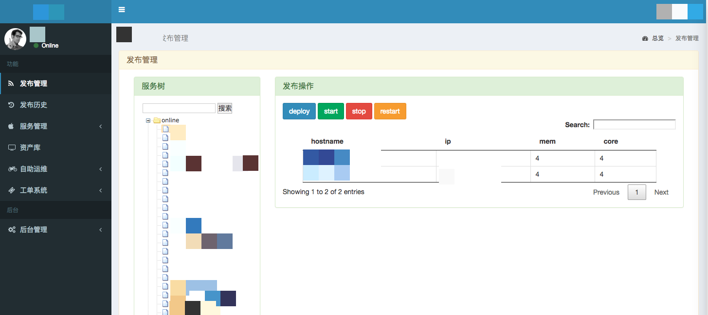

通过一点细微代码的修改,将某系统首页载入时间缩短了10倍有余. <!--more-->

系统首页大致这样

[](http://www.calmkart.com/wp-content/uploads/2018/08/201882204014dama.png)

逻辑是读取后台的所有服务列表,判断用户是否有权限,有权限则交给前端用ztree显示,并可进行部署操作,但因为服务太多,遍历服务后判断用户是否有权限后台耗时太长,用chrome查了下,后台数据处理费时2000ms,这样首页就载入的太慢了.

第一步,查代码,原始代码如下:

```
@login_required
def services(request):
    user = request.user
    _online_apps = App.objects.filter(app_env='online')
    _test_apps = App.objects.filter(app_env='test')
    _dev_apps = App.objects.filter(app_env='dev')

    online_apps = [a for a in _online_apps if user.has_perm('deploy_perm', a) or is_admin_by_group(user.username)]
    test_apps = [a for a in _test_apps if user.has_perm('deploy_perm', a) or is_admin_by_group(user.username)]
    dev_apps = [a for a in _dev_apps if user.has_perm('deploy_perm', a) or is_admin_by_group(user.username)]

    online_apps_name = [{'name':app.app_name, 'id':app.id} for app in online_apps]
    test_apps_name = [{'name':app.app_name, 'id':app.id} for app in test_apps]
    dev_apps_name = [{'name':app.app_name, 'id':app.id} for app in dev_apps]
    nodes = [
                {'name':'online',
                 'open':'true',
                 'children':online_apps_name
                },
                {'name':'test',
                 'open':'false',
                 'children':test_apps_name
                },
                {'name':'dev',
                 'open':'false',
                 'children':dev_apps_name
                }
    ];
    return render(request, 'services/services.html', {'nodes': json.dumps(nodes)})

```

也没什么复杂的,就是django models + django-guardian权限控制,然后返回数据给ztree生成树结构.

初步设想是因为列表生成式太多导致速度慢,写测试代码做测试

```
python manage.py shell

>>> import time
>>> from django.contrib.auth.models import User
>>> from services.views import new_service
>>> def test(user):
...     start = time.time()
...     new_service(user)
...     stop = time.time()
...     print stop-start
...
>>> pengng = User.objects.get(name='pengng')
>>> test(pengng)
1.93502497673
>>> test(pengng)
1.89282894135
>>> test(pengng)
2.14076519012
>>> test(pengng)
1.85515809059
>>> test(pengng)
1.91108703613

```

发现处理时间大致在1.8-1.9s之间,然后直接将上述原始代码第一步拆了出来

```
#仅测试这一步
online_apps = [a for a in _online_apps if user.has_perm('deploy_perm', a) or is_admin_by_group(user.username)]

#发现时间在1.2秒左右
>>> test(pengng)
1.25127100945
>>> test(pengng)
1.27178192139
>>> test(pengng)
1.22848701477
>>> test(pengng)
1.25300002098

```

继续分拆,发现是这个user.has\_perm('deploy\_perm',a)的guardian获取权限消耗了大量的时间 然后想起这个系统里权限都是以group来赋权的,获取用户对于服务的权限要先经过组再到服务,先遍历服务再单独查看用户是否有该组权限导致重复遍历太多,其实直接获取用户对应的所有拥有权限的服务对象即可(get\_objects\_for\_user()方法),尝试修改代码

```
@login_required
def services(request):
    user = request.user

    if is_admin_by_group(user.username):
        online_apps_name = [{'name': a.app_name, 'id': a.id}
                            for a in App.objects.filter(app_env='online')]
        test_apps_name = [{'name': a.app_name, 'id': a.id}
                          for a in App.objects.filter(app_env='test')]
        dev_apps_name = [{'name': a.app_name, 'id': a.id}
                         for a in App.objects.filter(app_env='dev')]
    else:
        online_apps_name = [{'name': a.app_name, 'id': a.id} for a in get_objects_for_user(
            user, 'deploy_perm', klass=App) if a.app_env == "online"]
        test_apps_name = [{'name': a.app_name, 'id': a.id} for a in get_objects_for_user(
            user, 'deploy_perm', klass=App) if a.app_env == "test"]
        dev_apps_name = [{'name': a.app_name, 'id': a.id} for a in get_objects_for_user(
            user, 'deploy_perm', klass=App) if a.app_env == "dev"]

    nodes = [
        {'name': 'online',
                 'open': 'true',
                 'children': online_apps_name
         },
        {'name': 'test',
                 'open': 'false',
                 'children': test_apps_name
         },
        {'name': 'dev',
                 'open': 'false',
                 'children': dev_apps_name
         }
    ]
    return render(request, 'services/services.html', {'nodes': json.dumps(nodes)})

```

然后重载文件

```
>>> reload(services.views)
<module 'services.views' from '/home/**/***/services/views.py'>
>>> test(pengng)
0.0817279815674
>>> test(pengng)
0.0788700580597
>>> test(pengng)
0.0756318569183

```

立竿见影,瞬间从2秒降低到了0.08秒左右 [](http://www.calmkart.com/wp-content/uploads/2018/08/企业微信截图_008058b2-bd81-4a9c-8442-63afc75ac870.png)收工

---

## 历史评论 (5 条)

*以下评论来自原 WordPress 站点，仅作存档展示。*

> **安全黄** (2018-08-06 11:56)
>
> 给大佬递槟榔

  > ↳ **calmkart** (2018-08-13 15:03)
  >
  > 安全王牛瘪！安全王请带我飞！

> **杨硕** (2018-08-09 17:23)
>
> 大哥喝冰可乐，psc快收了我啊

  > ↳ **calmkart** (2018-08-13 15:03)
  >
  > 就等着xsc上市了

> **吃瓜群众** (2018-11-07 10:31)
>
> 您的文章写得真好，给大佬倒橙汁
