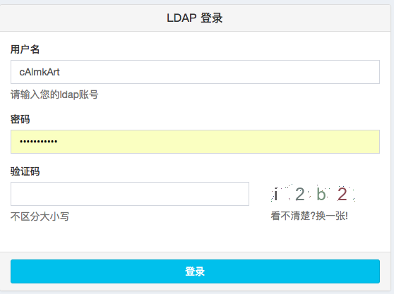

最近在做一个好玩的通用django单点登录系统，登录系统少不了验证码，参考了一下别人的做法和开源项目，总结一下。

结果如下：

 <!--more-->

主要思路流程是，后端根据随机码绘图，然后做混淆(我这里几乎没做模糊之类的混淆)，最后将随机验证码写进后端session里，前端获取图像后，提交时与session里的验证码做比较。流程还是比较简单的，大致代码如下。

1.captcha_handle.py

```python
captcha_handle.py
#用于生成随机字符串以及生成验证码图片

# -*- coding:utf-8 -*-
import random,string
from PIL import Image,ImageDraw,ImageFont,ImageFilter

#生成随机字符串
def _getRandomChar():
    #string模块包含各种字符串，以下为小写字母加数字
    ran = string.ascii_lowercase+string.digits
    char = ''
    for i in range(4):
        char += random.choice(ran)
    return char

#返回一个随机的RGB颜色
def _getRandomColor():
    return (random.randint(50,150),random.randint(50,150),random.randint(50,150))

def create_captcha():

    #创建图片，模式，大小，背景色
    img = Image.new('RGB', (120,30), (255,255,255))
    #创建画布
    draw = ImageDraw.Draw(img)
    #设置字体
    font = ImageFont.truetype('Arial.ttf', 25)

    code = _getRandomChar()
    #将生成的字符画在画布上
    for t in range(4):
        draw.text((30*t+5,0),code[t],_getRandomColor(),font)

    #生成干扰点
    for _ in range(random.randint(0,50)):
        #位置，颜色
        draw.point((random.randint(0, 120), random.randint(0, 30)),fill=_getRandomColor())

    #使用模糊滤镜使图片模糊
    # img = img.filter(ImageFilter.BLUR)
    #保存
    #img.save(''.join(code)+'.jpg','jpeg')
    return img,code

if __name__ == '__main__':
    create_code()

```

2.views.py

```python
views.py
#视图，生成验证码图片和code，返回图片，code存进session
class get_captcha(View):

    def get(self, request):
        '''
        生成验证码图片和验证码code,返回验证码图片,并以形式将验证码存放在session里
        '''
        try:
            f = BytesIO()
            img, code = create_captcha()
            request.session["captcha"] = code
            img.save(f,'PNG')
            return HttpResponse(f.getvalue())
        except Exception as e:
            log().error(str(e))

```

3.login.html

```jsx
{# html #}
<div class="col-xs-4">
    
    <p class="help-block" onclick="refresh_captcha()">
    看不清楚?换一张!
    </p>
</div>

{# js #}
<script>
    //刷新验证码
    function refresh_captcha() {
        $("#captcha_img").attr("src",$("#captcha_img")[0].src + '?');
    };
</script>

```

4.url.py

```python
url(r'^get_captcha/$',cas_views.get_captcha.as_view(), name="get_captcha"),

```

5.views.py

```python
#校验验证码是否正确
if request.session["captcha"].lower() != captcha.lower():
    return JsonResponse({"status":False, "msg":"验证码错误!"})

```

一些代码是参考网络上其他开源代码，不过其实也挺简单的，熟悉request.session就差不多了。做个记录。
