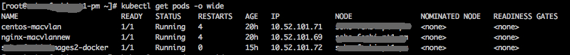
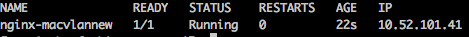

最近有一批旧服务器待用，没有用iaas，打算把docker当vm来用，还想采用k8s的编排方案。这样用户就可以很方便的通过ip直连docker，就像虚拟机一样。

原生的docker网络方案是不行的，于是采用了macvlan网络插件实现了k8s扁平二层网络。下面记录一下实现过程。 <!--more-->

首先肯定是装docker了

```bash
#卸载旧的docker
yum remove -y docker
#这里我是用自己搭的私人仓库和自定义的docker安装包,各位可酌情
yum install -y docker-ce.x86_64
systemctl start docker
systemctl enable docker

```

关闭防火墙,关闭swap

```bash
systemctl stop firewalld
systemctl disable firewalld
setenforce 0
sed -i 's/^SELINUX=enforcing$/SELINUX=permissive/' /etc/selinux/config
swapoff -a

```

配置k8s国内源,设置系统bridge参数

```ini
# 添加kubenetes源
cat < /etc/yum.repos.d/kubernetes.repo
[kubernetes]
name=Kubernetes
baseurl=http://mirrors.aliyun.com/kubernetes/yum/repos/kubernetes-el7-x86_64
enabled=1
gpgcheck=0
repo_gpgcheck=0
gpgkey=http://mirrors.aliyun.com/kubernetes/yum/doc/yum-key.gpg
        http://mirrors.aliyun.com/kubernetes/yum/doc/rpm-package-key.gpg
EOF
#调系统参数
cat <  /etc/sysctl.d/k8s.conf
net.bridge.bridge-nf-call-ip6tables = 1
net.bridge.bridge-nf-call-iptables = 1
EOF
sysctl --system

```

用国内源下载k8s相关镜像，重新打tag成k8s.gcr.io(就算可以翻墙，这一步也可以加速很多)

```bash
#docker镜像换国内
cat <  ~/get_image.sh
#!/bin/bash
images=(
    kube-apiserver:v1.13.1
    kube-controller-manager:v1.13.1
    kube-scheduler:v1.13.1
    kube-proxy:v1.13.1
    pause:3.1
    etcd:3.2.24
    coredns:1.2.6
)

for imageName in ${images[@]} ; do
    docker pull registry.cn-hangzhou.aliyuncs.com/google_containers/$imageName
    docker tag registry.cn-hangzhou.aliyuncs.com/google_containers/$imageName k8s.gcr.io/$imageName
done
EOF

#下载镜像
bash ~/get_image.sh

```

下载cni网络插件包 [https://github.com/containernetworking/plugins/releases](https://github.com/containernetworking/plugins/releases) 当前0.7.4版下载地址是 [https://github.com/containernetworking/plugins/releases/download/v0.7.4/cni-plugins-amd64-v0.7.4.tgz](https://github.com/containernetworking/plugins/releases/download/v0.7.4/cni-plugins-amd64-v0.7.4.tgz)

```bash
mkdir -p /opt/cni/bin/
cd /opt/cni/bin
wget https://github.com/containernetworking/plugins/releases/download/v0.7.4/cni-plugins-amd64-v0.7.4.tgz
tar xzvf cni-plugins-amd64-v0.7.4.tgz

```

安装k8s全家桶

```bash
yum install -y kubelet kubeadm kubectl --disableexcludes=kubernetes
systemctl enable kubelet && systemctl start kubelet

```

kubeadm做k8s初始化,记录node用来join的token连接(当然用crt也行)

```yaml
kubeadm init

```

最后配置网络插件macvlan

```bash
mkdir -p /etc/cni/net.d
vim /etc/cni/net.d/10-macvlan.conf
#用host-local的配法,各配置项很简单不详述
{
"name": "macvlannet",
"type": "macvlan",
"master": "br0",
"ipam": {
"type": "host-local",
"subnet": "10.52.101.0/24",
"rangeStart": "10.52.101.40",
"rangeEnd": "10.52.101.250",
"gateway": "10.52.101.254",
"routes": [
{ "dst": "0.0.0.0/0" }
]
}
}
#用dhcp的配法
{
"name": "macvlannet",
"type": "macvlan",
"master": "br0",
"ipam": {
"type": "dhcp",
}
}

#特别贴士---->在使用DHCP插件之前，需要先启动dhcp daemon
/opt/cni/bin/dhcp daemon &

```

看下主节点是否ok

```bash
#先参考官方文档配下环境变量啥的
#To make kubectl work for your non-root user, run these commands, which are also part of the kubeadm init output:

mkdir -p $HOME/.kube
sudo cp -i /etc/kubernetes/admin.conf $HOME/.kube/config
sudo chown $(id -u):$(id -g) $HOME/.kube/config

#Alternatively, if you are the root user, you can run:

export KUBECONFIG=/etc/kubernetes/admin.conf

#查看主节点是否ready
kubectl get nodes 
#查看各个pods情况
kubectl get pods --all-namespaces
#如果有问题,就用describe自己查查吧,一般都不难解决
kubectl describe pod

```

让master也可以运行pod

```bash
kubectl taint nodes --all node-role.kubernetes.io/master-

```

然后随便弄个pod试试管用了没

```yaml
#编辑yaml
vim pod-macvlan.yaml

apiVersion: v1
kind: Pod
metadata:
  name: nginx-macvlan
  labels:
    app: web
  annotations:
    cni: "macvlan"
spec:
  containers:
    - name: key-value-store
      image: nginx:latest
      imagePullPolicy: IfNotPresent
      ports:
        - containerPort: 6379
#创建pod
kubectl create -f pod-macvlan.yaml
#查看下pod情况
kubectl get pods -o wide

```

一般情况下是没问题，pod已经和宿主机在同一个2层网络了，同2层的其他网络也可以到该pod直通。 这时候就可以直接把pod当vm用了,和桥接的vm几乎没啥区别。

最后把其他机器作为node加入k8s集群中

```yaml
重复上面步骤
除了kubeadm init 换成
#举例
kubeadm join 10.52.101.28:6443 --token b7eber.9e26oenyos7j17v8 --discovery-token-ca-cert-hash sha256:9faeb9f6ce6281d2ae149c9424ec34297e6809ce1f88c920281f1e5da8b1b1f8
之外，其他不用变化啥。(确实多pull了几个kubeapi啥的镜像，不过无所谓了，不pull也行)

```

最终结果 nodes  pods 

测试某一个pod 

本机直接ip访问pod 

ok,搞定,打完收工

<div class="archived-comments">

<h2>历史评论 (13 条)</h2>
<p class="comment-notice">以下评论来自原 WordPress 站点，仅作存档展示。</p>
<div class="comment-item">
<div class="comment-meta"><strong>huanguo</strong> (2019-01-10 20:22)</div>
<div class="comment-body">给大佬点赞</div>
</div>
<div class="comment-item">
<div class="comment-meta"><strong>( 曰..曰 )</strong> (2019-01-22 21:01)</div>
<div class="comment-body">大佬，psc还缺保安吗？</div>
</div>
<div class="comment-item">
<div class="comment-meta"><strong>1</strong> (2019-02-17 22:04)</div>
<div class="comment-body">大佬，psc还缺保安吗？</div>
</div>
<div class="comment-item">
<div class="comment-meta"><strong>wardenlym</strong> (2019-03-14 14:36)</div>
<div class="comment-body">帮大忙了.jpg</div>
</div>
<div class="comment-item">
<div class="comment-meta"><strong>wardenlym</strong> (2019-03-14 15:34)</div>
<div class="comment-body">kubeadm init 时候不需要加任何参数吗？它是怎么能识别出来用的是macvlan的呢 请教</div>
</div>
<div class="comment-item comment-reply">
<div class="comment-meta"><strong>calmkart</strong> (2019-03-14 19:22)</div>
<div class="comment-body">k8s的网络插件需要配置啊,要写配置文件.k8s会自己读.而且随时可以换的.</div>
</div>
<div class="comment-item comment-reply">
<div class="comment-meta"><strong>WEICHANG</strong> (2019-08-06 16:47)</div>
<div class="comment-body">请问下，这个流程你那边能跑通吗？</div>
</div>
<div class="comment-item">
<div class="comment-meta"><strong>bro</strong> (2019-03-15 10:40)</div>
<div class="comment-body">请问下k8s网络插件可以热配置么，在不停服的情况下？</div>
</div>
<div class="comment-item comment-reply">
<div class="comment-meta"><strong>calmkart</strong> (2019-03-17 21:33)</div>
<div class="comment-body">可以</div>
</div>
<div class="comment-item">
<div class="comment-meta"><strong>carmer</strong> (2019-04-01 19:22)</div>
<div class="comment-body">老哥哥，你有github地址么，让小弟star下啊</div>
</div>
<div class="comment-item comment-reply">
<div class="comment-meta"><strong>calmkart</strong> (2019-04-01 19:30)</div>
<div class="comment-body">https://github.com/calmkart 欢迎关注，欢迎star</div>
</div>
<div class="comment-item">
<div class="comment-meta"><strong>WEICHANG</strong> (2019-08-06 17:50)</div>
<div class="comment-body">博主，我这边init初始化集群的时候，coredns节点起不来：0/1 nodes are available: 1 node(s) had taints that the pod didn't tolerate. reset了很多次都是这样。。。请问下有什么特别需要注意的地方吗。。。搞了两天了，绝望.jpg</div>
</div>
<div class="comment-item">
<div class="comment-meta"><strong>calmkart</strong> (2019-08-09 15:25)</div>
<div class="comment-body">你master节点有taints但是pods选择器没有tolerate导致调度器找不到可以调度的节点. 试着把master节点的污点去掉试试呢 kubectl taint nodes --all node-role.kubernetes.io/master-</div>
</div>
</div>
