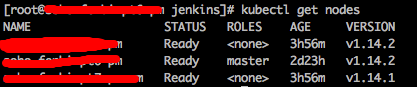
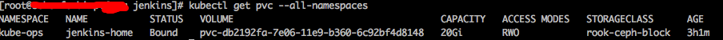

k8s中pod的存储在非单节点是不支持hostpath的，都得用各种分布式存储来实现.每个pvc对应的pv手工创建也很不现实,试了下rook-ceph分布式存储的搞法，感觉不错.其中也还是遇到了很多坑,这里稍微记录一下. <!--more--> 首先有一个三个节点的k8s集群  首先创建rook-ceph-common

```bash
wget https://raw.githubusercontent.com/rook/rook/master/cluster/examples/kubernetes/ceph/common.yaml
kubectl apply -f common.yaml

```

然后创建rook-ceph-operator

```bash
wget https://raw.githubusercontent.com/rook/rook/release-1.0/cluster/examples/kubernetes/ceph/operator.yaml
kubectl apply -f operator.yaml

```

以上两步基本上不会出啥问题,标准配置 接下来创建cluster的问题比较多,贴上我的配置

```yaml
vim cluster.yaml

apiVersion: ceph.rook.io/v1
kind: CephCluster
metadata:
  name: rook-ceph
  namespace: rook-ceph
spec:
  cephVersion:
    image: ceph/ceph:v14.2.1-20190430
    allowUnsupported: true
  #设置data路径到自己规划的路径
  dataDirHostPath: /home/shared/rook
  mon:
    count: 3
    allowMultiplePerNode: true
  dashboard:
    enabled: true
    port: 8443
    urlPrefix: /
    #关闭https
    ssl: false
  network:
    #如要在k8s集群外使用,这里可以打开
    hostNetwork: false
  rbdMirroring:
    workers: 0
  storage:
    #全节点使用
    useAllNodes: true
    useAllDevices: false
    deviceFilter:
    config:
      osdsPerDevice: "1"
    directories:
    - path: /home/shared/rook

```

```bash
kubectl apply -f cluster.yaml

```

查看部署情况  这样就基本上没问题了,k8s中的每个Node会启两个pod(rook-ceph-agent和rook-discover),并且mgr和osd都没问题。 然后给ceph-dashboard提供NodePort的外部访问service

```yaml
vim dashboard-external-http.yaml

apiVersion: v1
kind: Service
metadata:
  name: rook-ceph-mgr-dashboard-external-https
  namespace: rook-ceph
  labels:
    app: rook-ceph-mgr
    rook_cluster: rook-ceph
spec:
  ports:
  - name: dashboard
    port: 8443
    protocol: TCP
    targetPort: 8443
  selector:
    app: rook-ceph-mgr
    rook_cluster: rook-ceph
  sessionAffinity: None
  type: NodePort

```

```bash
kubectl apply -f dashboard-external-https.yaml

```

然后查看下service的情况,是否正常  这样就对了,可以访问一下http://<k8s-master-ip>:<ceph-dashboard-dashboard>，看看是不是能进ceph-dashboard

一般情况下问题不大,查看admin的默认密码

```bash
kubectl -n rook-ceph get secret rook-ceph-dashboard-password -o jsonpath="{['data']['password']}" | base64 --decode && echo

```

但是admin登陆进去了之后，肯定会疯狂500错误，查了下官方的issue，这里有bug。

**解决办法是:** **在dashboard里创建一个新role角色(右上角用户管理,roles)，把权限全钩上，然后去掉iscsi的所有权限。** **接着创建一个新用户,绑定这个新的role角色,最后用新用户登陆**

接着创建pool和storage用于自动生成pvc匹配的pv

```yaml
vim storageclass.yaml

apiVersion: ceph.rook.io/v1
kind: CephBlockPool
metadata:
  name: replicapool
  namespace: rook-ceph
spec:
  replicated:
    size: 2
---
apiVersion: storage.k8s.io/v1
kind: StorageClass
metadata:
   name: rook-ceph-block
provisioner: ceph.rook.io/block
parameters:
  blockPool: replicapool
  clusterNamespace: rook-ceph
  fstype: xfs

```

```bash
kubectl apply -f storagecalss.yaml

```

创建pool和storage之后通过dashboard或者命令 kubectl get cephcluster -n rook-ceph 查看一下集群是否health，如果是health就没毛病了

最后测试一下申请一个pvc看看是否会自动生成pv与之绑定

```yaml
apiVersion: v1
kind: PersistentVolumeClaim
metadata:
  name: jenkins-home
  namespace: kube-ops
  labels:
    app: jenkins-home
spec:
  storageClassName: rook-ceph-block
  accessModes:
  - ReadWriteOnce
  resources:
    requests:
      storage: 20Gi

```

 可见，管用了.

**外加一些小tips:**

如果rook-ceph配置有误需要还原重新配置,一定要遵循官方的清理步骤 [https://rook.github.io/docs/rook/v1.0/ceph-teardown.html](https://rook.github.io/docs/rook/v1.0/ceph-teardown.html) 切记要删除掉所有k8s的node上配置的data文件夹,不然会导致新集群无法初始化.

创建不出pod很多都是权限原因或者node无法调度,需要检查下rbac权限设置或者各个node的情况.

最后附上rook项目的github地址: [https://github.com/rook/rook](https://github.com/rook/rook)

<div class="archived-comments">

<h2>历史评论 (2 条)</h2>
<p class="comment-notice">以下评论来自原 WordPress 站点，仅作存档展示。</p>
<div class="comment-item">
<div class="comment-meta"><strong>huan</strong> (2019-05-28 16:30)</div>
<div class="comment-body">大佬又开始搞K8S，我要跟着学习学习</div>
</div>
<div class="comment-item comment-reply">
<div class="comment-meta"><strong>calmkart</strong> (2019-05-29 17:06)</div>
<div class="comment-body">学学学,建议买课,极客时间张磊博士的深入剖析k8s很好</div>
</div>
</div>
