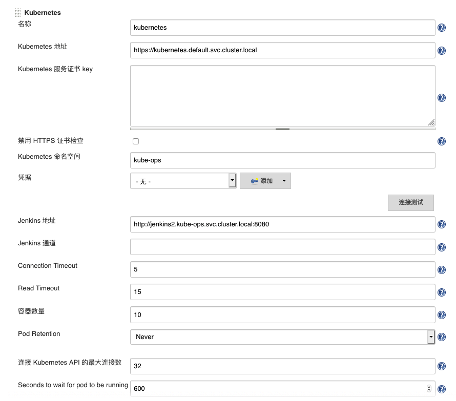

前面几篇文章已经谈过在k8s中如何实现rook/ceph持久化存储和服务发现/负载均衡/服务暴露策略，接下来几篇文章将以springboot项目为例，详解如何利用kubernetes容器编排平台实现cicd流水线(devops)。 <!--more--> 我们根据上面几篇文章已经有了一个k8s集群，常见的的cicd工具有jenkins，gitlab-ci和[drone](https://github.com/drone/drone)等等，但因为种种原因(比如gitlabci只支持gitlab，drone需要借助其他git仓库的用户权限系统不支持原生裸git)，这里最终还是选择了jenkins进行实验。

首先要解决的肯定是流程上的问题，就是所谓的cicd流程，参考了一些演讲ppt的做法，不过ppt嘛，你懂的，图画的还是很好看，但是也啰里八嗦的，不够简洁明快，有些地方明明很简单却故意讲的很高深莫测好像很厉害的样子，总之就是看着看着就觉得有点好笑 

大致流程图我就意思意思吧:

_**用户提交代码 ----> Jenkins触发构建 ----> 编译打包 ----> 归档成品 ----> 制作镜像 ---->k8s发布**_

其中构建触发这一部分因为是用的多分支流水线，觉得还是用触发扫描api由用户在运维平台点击一下比较好。构建因为是用的基于k8s的jenkins，所以同样用了动态的jenkins-slave，这样就可以做到有工作则自动生成jenkins-slave进行编译，无工作则自动销毁jenkins-slave释放资源，从而实现资源的最大化利用和伸缩性。

首先在k8s中部署jenkins 1. 创建jenkins-master-home pvc

```yaml
# vim jenkins-master-pvc.yaml

apiVersion: v1
kind: PersistentVolumeClaim
metadata:
  name: jenkins-master-home
  namespace: kube-ops
  labels:
    app: jenkins-master-home
spec:
  storageClassName: rook-ceph-block
  accessModes:
  - ReadWriteOnce
  resources:
    requests:
      storage: 100Gi

# kubectl apply -f jenkins-master-pvc.yaml 

```

2\. 创建 rbac

```yaml
# vim rbac.yaml

apiVersion: v1
kind: ServiceAccount
metadata:
  name: jenkins2
  namespace: kube-ops

---

kind: ClusterRole
apiVersion: rbac.authorization.k8s.io/v1beta1
metadata:
  name: jenkins2
rules:
  - apiGroups: ["extensions", "apps"]
    resources: ["deployments"]
    verbs: ["create", "delete", "get", "list", "watch", "patch", "update"]
  - apiGroups: [""]
    resources: ["services"]
    verbs: ["create", "delete", "get", "list", "watch", "patch", "update"]
  - apiGroups: [""]
    resources: ["pods"]
    verbs: ["create","delete","get","list","patch","update","watch"]
  - apiGroups: [""]
    resources: ["pods/exec"]
    verbs: ["create","delete","get","list","patch","update","watch"]
  - apiGroups: [""]
    resources: ["pods/log"]
    verbs: ["get","list","watch"]
  - apiGroups: [""]
    resources: ["secrets"]
    verbs: ["get"]

---
apiVersion: rbac.authorization.k8s.io/v1beta1
kind: ClusterRoleBinding
metadata:
  name: jenkins2
roleRef:
  apiGroup: rbac.authorization.k8s.io
  kind: ClusterRole
  name: jenkins2
subjects:
  - kind: ServiceAccount
    name: jenkins2
    namespace: kube-ops

# kubectl apply -f rbac.yaml

```

3.创建jenkins deployment和service

```yaml
# vim jenkins.yaml

---
apiVersion: extensions/v1beta1
kind: Deployment
metadata:
  name: jenkins2-deployment
  namespace: kube-ops
spec:
  template:
    metadata:
      labels:
        app: jenkins2
    spec:
      terminationGracePeriodSeconds: 10
      serviceAccountName: jenkins2
      containers:
      - name: jenkins
        image: jenkins/jenkins:lts
        imagePullPolicy: IfNotPresent
        ports:
        - containerPort: 8080
          name: web
          protocol: TCP
        - containerPort: 50000
          name: agent
          protocol: TCP
        resources:
          limits:
            cpu: 4000m
            memory: 8Gi
          requests:
            cpu: 1000m
            memory: 2Gi
        livenessProbe:
          httpGet:
            path: /login
            port: 8080
          initialDelaySeconds: 60
          timeoutSeconds: 5
          failureThreshold: 12
        readinessProbe:
          httpGet:
            path: /login
            port: 8080
          initialDelaySeconds: 60
          timeoutSeconds: 5
          failureThreshold: 12
        volumeMounts:
        - name: jenkinshome
          subPath: jenkins2
          mountPath: /var/jenkins_home
        env:
        - name: LIMITS_MEMORY
          valueFrom:
            resourceFieldRef:
              resource: limits.memory
              divisor: 1Mi
        - name: JAVA_OPTS
          value: -Xmx$(LIMITS_MEMORY)m -XshowSettings:vm -Dhudson.slaves.NodeProvisioner.initialDelay=0 -Dhudson.slaves.NodeProvisioner.MARGIN=50 -Dhudson.slaves.NodeProvisioner.MARGIN0=0.85 -Duser.timezone=Asia/Shanghai
      securityContext:
        fsGroup: 1000
      volumes:
      - name: jenkinshome
        persistentVolumeClaim:
          claimName: jenkins-master-home

---
apiVersion: v1
kind: Service
metadata:
  name: jenkins2
  namespace: kube-ops
  labels:
    app: jenkins2
spec:
  selector:
    app: jenkins2
  type: ClusterIP
  ports:
  - name: web
    port: 8080
    targetPort: web
  - name: agent
    port: 50000
    targetPort: agent

# kubectl apply -f jenkins.yaml

```

这个时候jenkins就已经起起来了，我们给jenkins的webui添加一个ingress负载均衡和服务暴露

```yaml
# vim kube-ops-ingress.yaml

apiVersion: extensions/v1beta1
kind: Ingress
metadata:
  name: kube-ops-ingress
  annotations:
    nginx.ingress.kubernetes.io/ssl-redirect: "false"
  namespace: kube-ops
spec:
  rules:
  - host: k8s-jenkins.example.cn
    http:
      paths:
      - path: /
        backend:
          serviceName: jenkins2
          servicePort: 8080

# kubectl apply -f kube-ops-ingress.yaml

```

这时候因为ingress service是用的master node的externalIp，所以我们可以直接通过修改dns，将k8s-jenkins.example.cn域名指向master node的externalIp，然后直接访问k8s-jenkins.example.cn就可以访问到jenkins服务。(有问题可以查看下kubectl get ingress -o wide --all-namespaces)

然后安装常见的插件，进入jenkins后记得再安装如下两个插件 blueOcean(新一代的流水线UI)，kubernetes(k8s slave支持)，Multibranch Scan Webhook Trigger(多分枝流水线扫描触发器)

安装好之后，进入设置，拉到最下面，选择添加一个云(k8s)  按如上配置，在页面测试连接k8s正常即可(jenkins服务名这里叫jenkins2，按实际修改)

**_至于下面的是否添加镜像，我推荐是不在这里添加，而选择用Yaml直接编写添加。原因是，这里添加slave k8s pod tempalte的话，slave编号无法动态化，会导致后以后构建任务等待前任务，无法多slave并行。(很多文章会在这里添加slave pod template，然后用一个自由风格软件项目做例子，那根本无法在实际环境中用的)_**

**_这里还有个小坑，无论是yaml的slave k8s pod tempalte还是在jenkins设置里页面添加的slave k8s pod template，如果想使用自定义slave image的话，containers: - name 一定要填写成- name: jnlp，否则会不读取自定义slave image而采用官方的[docker-jnlp-slave](https://github.com/jenkinsci/docker-jnlp-slave)。_**

接下来我们创建自己的jenkins-jnlp-slave容器，参考官方的[docker-jnlp-slave](https://github.com/jenkinsci/docker-jnlp-slave) Dockerfile如下

```bash
ARG VERSION=0.0.1
ARG user=jenkins
ARG group=jenkins
ARG uid=1000
ARG gid=1000

ENV HOME /home/${user}
RUN groupadd -g ${gid} ${group}
RUN useradd -d $HOME -u ${uid} -g ${group} ${user}
LABEL maintainer="calmkart@calmkart.com" Description="jenkins jnlp slave image" Vendor="calmkart@calmkart.com" Version="${VERSION}"

ARG AGENT_WORKDIR=/home/${user}/agent

RUN curl --create-dirs -fsSLo /usr/share/jenkins/slave.jar https://repo.jenkins-ci.org/public/org/jenkins-ci/main/remoting/3.29/remoting-3.29.jar \
  && chmod 755 /usr/share/jenkins \
  && chmod 644 /usr/share/jenkins/slave.jar \
  && rm -rf /etc/yum.repos.d/*

COPY kubectl kubectl
COPY jdk/ ./jdk
COPY maven ./maven
COPY jenkins-slave /usr/local/bin/jenkins-slave
COPY CentOS-Base.repo /etc/yum.repos.d/
COPY epel.repo /etc/yum.repos.d/

RUN yum makecache \
  && yum install -y unzip.x86_64 \
  && chmod +x ./kubectl \
  && chmod +x /usr/local/bin/jenkins-slave \
  && mv ./kubectl /usr/local/bin/kubectl \
  && /bin/bash maven/default/install_maven \
  && /bin/bash jdk/default/install_jdk \
  && yum install -y nodejs \
  && yum install -y python36.x86_64 \
  && yum install -y docker-ce.x86_64 \
  && yum install -y git \
  && yum install -y which

USER ${user}
ENV PATH=/usr/local/sbin:/usr/local/bin:/usr/sbin:/usr/bin:/sbin:/bin:/opt/maven/bin:/usr/java/jdk/bin
RUN export PATH=$PATH:/opt/maven/bin:/usr/java/jdk/bin
ENV AGENT_WORKDIR=${AGENT_WORKDIR}
RUN mkdir /home/${user}/.jenkins && mkdir -p ${AGENT_WORKDIR}

VOLUME /home/${user}/.jenkins
VOLUME ${AGENT_WORKDIR}
WORKDIR /home/${user}

ENTRYPOINT ["jenkins-slave"]

```

这里创建的是一个基于centos的jenkins jnlp slave容器镜像，安装了python2,python3,nodejs,docker,kubectl,maven,git等工具和环境。

将该镜像build并上传到harbor仓库即可在项目的Jenkinsfile中使用.

以下是具体待构建项目中jenkins jnlp slave的pod template信息

```yaml
# vim jnlp-slave-declarative.yaml
metadata:
  namespace: kube-ops
spec:
  containers:
  - name: jnlp
    image: harbor.example.org/example/jenkins-jnlp-slave:v0.0.1
    workingDir: /home/jenkins
    ttyEnabled: true
    privileged: false
    alwaysPullImage: false
    volumeMounts:
    - name: volume-0
      mountPath: /var/run/docker.sock
    - name: volume-1
      mountPath: /home/jenkins/.kube
    - name: volume-2
      mountPath: /home/jenkins
    - name: volume-3
      mountPath: /root/.m2
  volumes:
  - name: volume-0
    hostPath:
      path: /var/run/docker.sock
      type: ""
  - name: volume-1
    hostPath:
      path: /root/.kube
      type: ""
  - name: volume-2
    nfs:
      path: /home/shared/nfs/jenkins-home
      server: 10.1.33.159
  - name: volume-3
    nfs:
      path: /home/shared/nfs/maven-home
      server: 10.1.33.159

```

关于这个slave k8s pod template要解释一些东西，这里挂载了4个volume到slave中，分别是

1.在slave中调用宿主机的docker命令,用于构造和上传镜像 /var/run/docker.sock -> /var/run/docker.sock

2.在slave中调用宿主机的kubectl命令,用于在k8s中发布项目(创建deployment和service) /root/.kube -> /home/jenkins/.kube

3.搭建了一个nfs用于多个slave共享workspace,避免多次clone代码 /home/shared/nfs/jenkins-home -> /home/jenkins

4.搭建了一个nfs用于多个slave共享本地maven仓库,避免多次下载jar包,同时统一maven配置 /home/shared/nfs/maven-home —> /root/.m2

_这里为什么不用ceph呢？原因很简单，因为ceph rbd块存储不支持ReadWriteMany，而cephfs共享存储虽然支持ReadWriteMany但是不支持分区。所以还是采用了最简单的nfs实现共享存储。_

在项目的Jenkinsfile中编写如下agent字段调用该pod template的slave

```python
def label_tag = "slave-${UUID.randomUUID().toString()}"
pipeline {
  agent {
    kubernetes {
      label label_tag
      yamlFile 'jnlp-slave-declarative.yaml'
    }
  }
  }
}

```

这是申明式pipeline的用法中比较好的写法，因为如果不单独写一个yaml的话我记得是不支持很多细节语法的.（具体细节参考[jenkins kubernetes plugin](https://github.com/jenkinsci/kubernetes-plugin)插件说明）

做到这里之后，我们扫描多分支流水线，就可以发现创建一个新slave处理构建任务，构建完成则自动销毁了。 但这还远远不够，很多细节没有处理，下篇文章再详述编译发布构成和申明式Pipeline Jenkinsfile,以及项目Dockerfile镜像详细写法例子。

<div class="archived-comments">

<h2>历史评论 (4 条)</h2>
<p class="comment-notice">以下评论来自原 WordPress 站点，仅作存档展示。</p>
<div class="comment-item">
<div class="comment-meta"><strong>lsprit</strong> (2019-06-14 19:28)</div>
<div class="comment-body">大神，我知道CI是持续集成，CD是什么啊？</div>
</div>
<div class="comment-item comment-reply">
<div class="comment-meta"><strong>calmkart</strong> (2019-06-17 13:25)</div>
<div class="comment-body">continuous integration continuous deployment</div>
</div>
<div class="comment-item">
<div class="comment-meta"><strong>lizhengyi</strong> (2019-06-24 15:37)</div>
<div class="comment-body">楼主最近看机会吗，我们组正在招聘运维开发工程师，主要负责公司发布系统和监控系统的开发和维护，公司叫省钱快报，办公地点在北二环，地铁5号线雍和宫站附近，薪资待遇业界上游水平，期待您的回复。</div>
</div>
<div class="comment-item comment-reply">
<div class="comment-meta"><strong>calmkart</strong> (2019-06-26 15:06)</div>
<div class="comment-body">不好意思,年内没有换工作的意向.</div>
</div>
</div>
