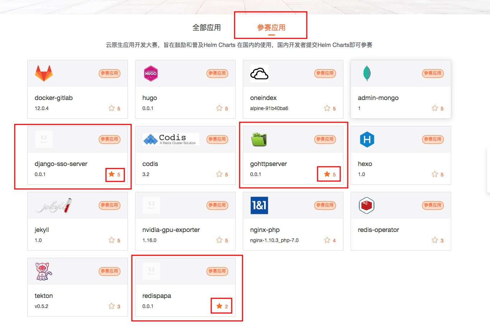

首先拉个票 \[阿里云开发者社区-云原生应用大赛\] [https://developer.aliyun.com/hub](https://developer.aliyun.com/hub) 麻烦不反感拉票的,有兴趣有空的,给我提交的下面三个应用点个星星，多谢了。(阿里云普通账号即可投票,支付宝登录亦可) [](http://www.calmkart.com/wp-content/uploads/2019/08/C0B4B70807593CFFFD06C612FCE18009.jpg) <!--more--> 在k8s的容器云环境中,应用的部署方式通常是编写对应的api对象申明文件来完成. 比如比较简单的应用,如简单的django应用,我们通常就需要首先编写deployment用于控制replicaset->pod，然后编写service控制deployment，最后编写ingress做服务暴露. 而比较复杂的应用,如prometheus,我们通常就要用到用户定义api对象crd,然后编写对应的循环和控制,最后完成上面的那一套部署方式.

显然,这挺复杂的,而且特别多的东西感觉都可以用模板传变量来代替.那么我们是否需要自己编写一个系统用以根据参数自动生成这些复杂的yaml文件呢?答案基本上是没必要的(当然一切特殊情况还是需要),我们有helm来帮我们做这一切.

你可以将helm与k8s的关系看作yum之于centos的关系.helm将应用进行打包,我们就可以通过填写必要的参数，自动生成和部署批量的yaml文件，从而实现一键部署复杂的系统. 比如promethues在k8s中的部署,如果我们用编写Yaml的方法来部署,很可能就要编写数十个yaml文件(包括promethues,alertmanager,grafana,push-gateway等等),但我们如果使用helm，我们就只需要一行命令

```
helm install stable/prometheus-operator

```

那么，我们应该怎样才能制作helm中的chart软件包用于给用户自动安装呢?首先,我们需要安装helm,下载二进制文件即可. [https://github.com/helm/helm/releases](https://github.com/helm/helm/releases)

然后我们开始创建一个helm软件包(project-name可替换)

```
helm create <project-name>

```

我们可以看到，创建了如下文件夹 [](http://www.calmkart.com/wp-content/uploads/2019/08/企业微信截图_86ed0736-bdd6-4486-83a6-a6dedf0d876d.png)

其中template下就是各个yaml文件的模板,而values.yaml则是可以填充进各个yaml文件模板的参数(用户可调节). 我们要做的就是对values.yaml和template下各模板做修改,以适应实际应用的需求.

其中,template的模板语法用的是golang的template语法，再加上sprig模板库函数([https://github.com/Masterminds/sprig](https://github.com/Masterminds/sprig))

当我们设计好了一个chart之后,我们可以通过如下命令测试生成的yaml文件是否符合预期

```
helm install  --dry-run --debug ../<project-name>                                                

```

我们可以通过-f values.yaml统一设置参数,也可以通过--set 单一设置参数

如果符合预期,我们就可以直接安装了

```
helm install  ../<project-name>

```

更多的helm相关的资料可以参考 [helm用户与开发者指南(中文版)](https://whmzsu.github.io/helm-doc-zh-cn/)

---

## 历史评论 (4 条)

*以下评论来自原 WordPress 站点，仅作存档展示。*

> **huangguohuan** (2019-08-15 14:29)
>
> 向dalao低头，投了

  > ↳ **calmkart** (2019-08-15 19:11)
  >
  > 多谢安全王

> **liuhuohua** (2019-08-16 11:15)
>
> 喜欢看博主的技术文章，票已投

  > ↳ **calmkart** (2019-08-20 13:36)
  >
  > 谢谢
